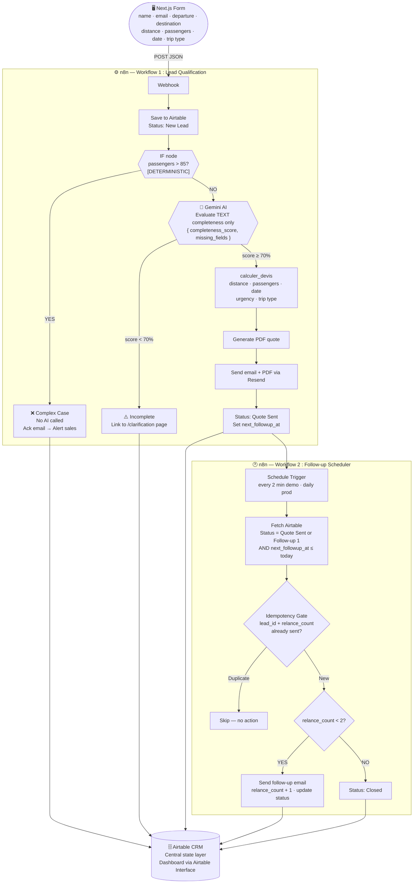

# L1 — Dossier de Cadrage
## Automatisation de la Chaîne Commerciale — NeoTravel

| | |
|---|---|
| **Formation** | MBA1 — Epitech |
| **Groupe** | Gendell Friolanita · Inde · Yahia |
| **Date de rendu** | 24 juin 2026 |
| **Entreprise partenaire** | NeoTravel (autocar-location.com) |

---

## 1. Présentation de l'entreprise

NeoTravel est un intermédiaire spécialisé dans le transport de groupe, fondé en 2010 et basé à Levallois-Perret (92). L'entreprise ne possède aucun véhicule propre : elle coordonne un réseau de prestataires (affréteurs de cars et autocars) pour répondre aux demandes de particuliers, d'entreprises et d'organismes publics sur l'ensemble du territoire français, soit 647 villes prioritaires dans 98 départements.

L'équipe commerciale reçoit les demandes, qualifie les prospects, élabore les propositions tarifaires et assure le suivi client. Une équipe de réservation prend ensuite le relais pour identifier les transporteurs partenaires disponibles.

---

## 2. Problématique Métier

### 2.1 Situation actuelle

NeoTravel reçoit environ **60 demandes par jour** via ses canaux digitaux (publicités en ligne, formulaire web, téléphone). Ces demandes sont traitées manuellement par les commerciaux, qui sont rémunérés à la commission. Résultat : ils privilégient les demandes à fort potentiel et laissent de côté les autres.

Une partie significative des leads issus des campagnes publicitaires payantes ne sont donc jamais traités. C'est de l'argent perdu deux fois : le coût d'acquisition a déjà été engagé, et la commande ne se concrétise pas.

### 2.2 Problèmes identifiés

| #   | Problème                              | Impact direct                                                      |
| --- | ------------------------------------- | ------------------------------------------------------------------ |
| 1   | Leads non traités par les commerciaux | Perte de CA sur des leads déjà payés                               |
| 2   | Délais de réponse trop longs (24-48h) | Perte de clients au profit de concurrents plus réactifs            |
| 3   | Absence de relances systématiques     | Opportunités abandonnées faute de suivi                            |
| 4   | Qualification manuelle chronophage    | Temps commercial gaspillé sur des tâches à faible valeur ajoutée   |
| 5   | Aucune traçabilité du pipeline        | Direction sans visibilité sur le volume et l'état des opportunités |
| 6   | Tarification calculée manuellement    | Risque d'erreur, incohérence entre commerciaux, lenteur            |

### 2.3 Enjeu

NeoTravel a suffisamment de leads. Ce qui manque, c'est la capacité à tous les traiter. Les budgets publicitaires ne peuvent pas augmenter tant que la capacité de traitement reste fixe. Automatiser le traitement, c'est augmenter le rendement sans toucher aux effectifs.

---

## 3. Analyse Concurrentielle

NeoTravel s'adresse principalement aux entreprises, comités d'entreprise, associations et organisateurs d'événements qui ont besoin de déplacer entre 8 et 85 personnes en France ou en Europe. Sur ce segment, le marché se partage entre des plateformes rapides mais peu profondes et des acteurs humains compétents mais lents.

| Concurrent | Positionnement | Ce qu'ils font que NeoTravel ne fait pas encore |
|---|---|---|
| GetTransfer | Marketplace internationale de transferts privés (aéroport, ville) | Réservation en self-service 24h/24, paiement en ligne instantané, notation chauffeur |
| Mozio | Agrégateur de transport terrestre B2B/B2C, API pour voyagistes | Connexion directe aux systèmes hôtels/agences, catalogue mondial de prestataires |
| Autocars.com | Portail de mise en relation groupes + autocars en France | Formulaire devis standard, comparaison multi-transporteurs, espace client autonome |
| Agences locales (Havas, PME) | Vente packagée (transport + hébergement + activités) | Offre clé en main, fidélisation via programme voyageur, relations entreprises établies |

GetTransfer et Mozio ont été conçus pour le transfert ponctuel ou les API B2B. Ils ne gèrent pas les groupes complexes (>20 passagers, logistique multi-étapes, guides, nuits chauffeur) : leur modèle est volumétrique et standardisé, sans négociation terrain.

Autocars.com couvre la France uniquement, avec un formulaire générique sans qualification IA et aucun suivi commercial automatisé. Le devis part manuellement depuis les transporteurs partenaires.

Les agences locales ont la relation humaine mais des processus entièrement manuels : pas de dashboard, délais de réponse de 24 à 72h, dépendance aux commerciaux individuels.

Sur le segment transport de groupe en France, aucun acteur ne propose aujourd'hui un assistant capable de qualifier une demande, calculer un devis en temps réel et déclencher des relances automatiques. Les plateformes digitales ont automatisé la réservation standard, pas la qualification de leads complexes. Les acteurs humains n'ont aucune couche IA. Ce vide justifie directement le choix d'architecture : un agent n8n avec formulaire conversationnel n'est pas de la sur-ingénierie, c'est une réponse à un besoin que personne n'adresse.

NeoTravel n'est ni une marketplace anonyme ni une agence généraliste. Son avantage tient à trois choses que les concurrents ne combinent pas : un réseau de prestataires locaux avec une connaissance fine des contraintes opérationnelles (types de véhicules, réglementation, disponibilités saisonnières) ; un traitement humain dédié pour les cas complexes (>85 passagers, logistique multi-jours) plutôt qu'un renvoi vers un formulaire générique ; et une réactivité automatisée qui livre un premier devis en moins de 5 minutes pour les cas standards, là où la concurrence prend 24 à 72h.

Les plateformes digitales ont la vitesse mais pas la profondeur. Les agences locales ont la profondeur mais pas la vitesse. En automatisant l'opérationnel, NeoTravel libère ses commerciaux pour ce qui compte : le conseil, la négociation et la fidélisation.

| Critère | Plateformes digitales | Autocaristes traditionnels | NeoTravel (cible) |
|---|:---:|:---:|:---:|
| Délai premier devis | < 1 min | 24-48h | **< 5 min (standard)** |
| Cas complexes | ✗ | ✓ | **✓ (HITL)** |
| Relances automatiques | ✗ | Manuel | **✓ (n8n)** |
| Cohérence des prix | Algorithmique | Variable | **Déterministe** |
| Qualification IA | ✗ | ✗ | **✓ (Gemini)** |
| Pipeline visible | ✗ | ✗ | **✓ (Airtable)** |

---

## 4. Cartographie As-Is / To-Be

### Avant — processus actuel

| Étape | Acteur | Délai | Problème |
|---|---|---|---|
| Lead reçu par email ou formulaire | Système | Immédiat | Aucune centralisation automatique |
| Commercial voit (ou non) le lead | Commercial | Variable | Sélection subjective |
| Qualification manuelle | Commercial | 1-4h | Chronophage, non systématique |
| Calcul du devis à la main | Commercial | 1-2h | Risque d'erreur, incohérence |
| Envoi de l'email | Commercial | +24h en moyenne | Trop lent |
| Relance (si le commercial y pense) | Commercial | Aléatoire | Oublis fréquents |
| Suivi pipeline | Direction | Impossible | Aucun outil |

### Après — avec le prototype

| Étape | Acteur | Délai | Amélioration |
|---|---|---|---|
| Lead reçu via formulaire conversationnel | Next.js | Immédiat | 100 % des leads captés |
| Sauvegarde automatique dans Airtable | n8n | < 1 sec | Pipeline visible dès l'arrivée |
| Contrôle métier (passagers > 85) | n8n IF node | < 1 sec | Déterministe, sans IA |
| Qualification IA (complétude textuelle) | Gemini 2.0 Flash | < 30 sec | Score objectif sur les champs texte |
| Calcul du devis | `calculer_devis()` | < 1 sec | Déterministe, sans erreur, traçable |
| Envoi email + PDF | Resend | < 5 min | Immédiat après soumission |
| Relances automatiques | n8n WF2 | J+3 / J+7 | 100 % des leads relancés |
| Suivi pipeline en temps réel | Airtable Interface | Permanent | Direction et commerciaux alignés |

### Flux To-Be étape par étape

1. Le prospect remplit le formulaire en ligne (Next.js) — une question par écran.
2. À la soumission, les données sont envoyées en JSON au webhook n8n WF1.
3. **Sauvegarde immédiate** dans Airtable (statut : Nouveau Lead) — avant toute qualification.
4. **Contrôle métier déterministe** : si `passagers > 85`, le lead passe immédiatement en "Cas Complexe" sans appel IA.
5. Si ≤ 85 passagers : **Gemini évalue la complétude textuelle** des champs (email, départ, destination, date, distance). Output : `{ completeness_score: int, missing_fields: string[] }`.
6. Si score < 70 % : email avec lien `/clarification?id=...` → statut "Incomplet".
7. Si score ≥ 70 % : `calculer_devis()` est appelé avec les données validées.
8. Un **PDF de devis** est généré et attaché.
9. L'email est envoyé via **Resend** — délai total < 5 minutes depuis la soumission.
10. Airtable est mis à jour (statut : Devis envoyé, `next_followup_at` calculé).
11. Le **Workflow 2** (schedule trigger) surveille les relances dues et envoie les emails J+3 / J+7.

Ce qui change avec le prototype : la capture, la qualification, le calcul et les relances sont entièrement automatisés. Aucun lead n'est ignoré, chaque décision est tracée, chaque relance est planifiée.

Ce qui ne change pas : la négociation avec les transporteurs partenaires et les cas complexes (>85 passagers, demandes ambiguës) restent assurés par un commercial humain. C'est le principe appliqué en pratique : automatiser l'opérationnel, pas la relation.

---

## 5. Matrice de Priorisation des Problématiques

> Notation 1-3 par critère (3 = fort). Complexité : 3 = facile à résoudre.

|   #   | Friction                                  | Impact CA | Impact Client | Urgence | Complexité | Score  |
| :---: | ----------------------------------------- | :-------: | :-----------: | :-----: | :--------: | :----: |
| **1** | **Leads non traités par les commerciaux** |   **3**   |     **3**     |  **3**  |   **2**    | **11** |
|   2   | Délais de réponse > 24h                   |     3     |       3       |    3    |     2      |   11   |
|   3   | Absence de relances systématiques         |     3     |       2       |    2    |     3      |   10   |
|   4   | Tarification manuelle et incohérente      |     2     |       2       |    2    |     3      |   9    |
|   5   | Pipeline commercial sans visibilité       |     2     |       1       |    2    |     3      |   8    |
|   6   | Qualification chronophage                 |     2     |       1       |    2    |     2      |   7    |

**Priorité n° 1 : les leads non traités.** Chaque lead ignoré représente un budget publicitaire dépensé sans retour. C'est la perte la plus directement chiffrable du lot.

---

## 6. Matrice de Priorisation des Solutions

> Notation 1-3 par critère (3 = fort). Coût : 3 = peu coûteux à implémenter.

| # | Fonction | Valeur métier | Faisabilité | Coût | Score | Priorité |
|:---:|---|:---:|:---:|:---:|:---:|---|
| 1 | **Centralisation CRM (Airtable)** | 3 | 3 | 3 | **9** | **P1 — MVP absolu** |
| 2 | **Calcul de devis (`calculer_devis()`)** | 3 | 3 | 3 | **9** | **P1 — MVP absolu** |
| 3 | Capture de la demande (formulaire) | 3 | 3 | 3 | **9** | P1 — MVP absolu |
| 4 | Envoi par email (Resend) | 3 | 3 | 3 | **9** | P1 — MVP absolu |
| 5 | Escalade humaine (HITL) | 3 | 3 | 3 | **9** | P1 |
| 6 | Relances automatiques (n8n WF2) | 3 | 2 | 3 | 8 | P1 |
| 7 | Qualification IA (Gemini) | 3 | 2 | 3 | 8 | P1 |
| 8 | Tableau de bord (Airtable Interface) | 2 | 3 | 3 | 8 | P1 |
| 9 | Génération du PDF | 2 | 2 | 3 | 7 | P2 |
| 10 | Traçabilité horodatée | 1 | 3 | 3 | 7 | P2 |

Airtable et `calculer_devis()` sont les deux fondations sur lesquelles tout repose. Sans CRM, les leads restent invisibles. Sans fonction déterministe, les devis varient d'un commercial à l'autre.

---

## 7. Solution Proposée

### 7.1 Vision

Le prototype couvre la chaîne commerciale complète, du formulaire jusqu'aux relances. Ce qui sort du cadre (grands groupes, conditions atypiques) continue d'aller vers un commercial.

### 7.2 Périmètre fonctionnel

|  #  | Fonction                  | Description                                                                  |
| :-: | ------------------------- | ---------------------------------------------------------------------------- |
|  1  | Capture de la demande     | Formulaire conversationnel multi-étapes accessible en ligne                  |
|  2  | Centralisation CRM        | Chaque lead est enregistré automatiquement, sans exception                   |
|  3  | Qualification automatique | L'agent IA évalue la complétude des champs texte de la demande               |
|  4  | Contrôle métier (HITL)    | Nœud IF déterministe : si passagers > 85, escalade immédiate sans IA         |
|  5  | Calcul de devis           | Fonction `calculer_devis()` : tarification cohérente, déterministe, traçable |
|  6  | Génération du PDF         | Document de devis généré automatiquement                                     |
|  7  | Envoi par email           | Le devis est transmis au client dans les minutes suivant la demande          |
|  8  | Relances automatiques     | Suivi programmé selon les délais d'urgence (J+2 ou J+3/J+7)                  |
|  9  | Tableau de bord           | Pipeline en temps réel pour la direction et les commerciaux                  |
| 10  | Traçabilité               | Chaque action est horodatée et liée au lead correspondant                    |

### 7.3 Ce que le système ne fait pas

Les commerciaux restent responsables des cas complexes, des contrats et de la coordination avec les transporteurs partenaires (hors périmètre). Aucun prix n'est estimé : tout passe par `calculer_devis()`. L'IA ne touche à aucune valeur numérique métier, ni seuils, ni compteurs, ni coefficients.

---

## 8. Architecture Technique

### 8.1 Stack technologique

| Composant                   | Outil                     | Justification                                                                        |
| --------------------------- | ------------------------- | ------------------------------------------------------------------------------------ |
| Frontend / Interface client | Next.js (React)           | Framework standard, déployable en un clic sur Vercel, gratuit                        |
| Orchestrateur IA            | n8n (self-hosted)         | Moteur de workflow visuel, connexions API, gestion des relances — gratuit en local   |
| Modèle de langage           | Gemini 2.0 Flash (Google) | Gratuit (1 500 req/jour), JSON natif, suffisant pour la qualification textuelle      |
| Base de données + Dashboard | Airtable                  | Gratuit, interface no-code pour le pipeline commercial, dashboard sans développement |
| Envoi d'emails              | Resend                    | Gratuit (3 000 emails/mois), API simple, supporte les pièces jointes PDF             |
| Déploiement                 | Vercel                    | Gratuit, déploiement automatique depuis GitHub                                       |
| Versioning                  | GitHub                    | Gratuit, collaboration entre membres de l'équipe                                     |

Coût total : 0 €/mois pour le prototype et la démonstration.

Qui fait quoi dans l'architecture :

| Couche               | Outil                                 | Rôle                                                                               |
| -------------------- | ------------------------------------- | ---------------------------------------------------------------------------------- |
| Frontend             | Next.js                               | Formulaire multi-étapes, validation côté client, envoi JSON au webhook             |
| Orchestrateur        | n8n                                   | Coordination des nœuds, branches IF, retries, scheduling des relances              |
| LLM                  | Gemini 2.0 Flash                      | Complétude textuelle uniquement. Pas de calcul, pas de règle chiffrée, pas de prix |
| Outils déterministes | IF node + `calculer_devis()` + Resend | Tout ce qui doit donner le même résultat à chaque appel                            |
| Données              | Airtable                              | Source de vérité unique : leads, devis, matrices tarifaires, logs                  |

### 8.2 Justification du choix : Gemini 2.0 Flash

| Critère                             | Gemini 2.0 Flash                                                          | Alternative (GPT-4o)         | Verdict                |
| ----------------------------------- | ------------------------------------------------------------------------- | ---------------------------- | ---------------------- |
| **Coût**                            | 0 € — 1 500 req/jour gratuites                                            | ~0,03 $/1K tokens            | Gemini gagne           |
| **Qualité de sortie**               | Suffisant pour évaluer la complétude de champs texte                      | Surqualifié pour cette tâche | Inutile de payer plus  |
| **Latence**                         | < 2 sec par appel                                                         | Similaire                    | Équivalent             |
| **Outputs structurés (JSON natif)** | Mode JSON : retourne `{ completeness_score, missing_fields }` directement | Idem                         | Équivalent             |
| **Consommation quota**              | 60 leads/jour × 1 appel = 60 req/jour (quota : 1 500)                     | Sans objet                   | Largement suffisant    |
| **Adéquation au cas d'usage**       | Tâche unique et bien définie : complétude textuelle uniquement            | Pas de gain                  | Aucune raison de payer |

### 8.3 Schéma d'architecture



### 8.4 Fonctionnement du système

Le système repose sur deux workflows n8n connectés via Airtable.

Le **Workflow 1** se déclenche à la soumission du formulaire. Le lead est sauvegardé dans Airtable immédiatement. Ensuite, un nœud IF déterministe vérifie si le nombre de passagers dépasse 85 : si oui, le lead passe directement en "Cas Complexe" sans aucun appel à l'IA. Si non, Gemini évalue uniquement la complétude textuelle des champs (est-ce que l'email est valide ? La destination est-elle renseignée ? La date est-elle précisée ?). Si le score est insuffisant, un lien de clarification est envoyé. Si tout est complet, `calculer_devis()` calcule le prix, un PDF est généré, et le devis est envoyé par email en moins de cinq minutes.

Le **Workflow 2** tourne en tâche de fond sur un planning défini. Il récupère les leads dont la date de relance est échue, passe par une porte d'idempotence (voir §8.5), et envoie l'email si la limite n'est pas atteinte.

L'IA fait une seule chose : lire les champs texte et dire s'ils sont remplis ou non. Elle ne calcule rien, ne vérifie aucune valeur numérique et ne prend aucune décision commerciale.

### 8.5 Règles métier et déclencheurs

**Règles de qualification (déterministes, avant l'IA)**

| Condition                                | Évalué par                   | Action                                                      |
| ---------------------------------------- | ---------------------------- | ----------------------------------------------------------- |
| `passagers > 85`                         | Nœud IF n8n                  | Statut "Cas Complexe" + alerte commerciale — aucun appel IA |
| Champs texte incomplets (score < 70 %)   | Gemini (textuel uniquement)  | Statut "Incomplet" + lien `/clarification`                  |
| Client mentionne un contrat personnalisé | Gemini (détection textuelle) | Escalade immédiate                                          |

**Règles de relance**

| Cas                   | Relance 1 | Relance 2           | Clôture               |
| --------------------- | --------- | ------------------- | --------------------- |
| Urgent (départ < 72h) | J+2       | —                   | J+2 si pas de réponse |
| Standard              | J+3       | J+7 (J+3 + 4 jours) | Après Relance 2       |

**Idempotence des relances**

Chaque envoi est protégé par une **clé d'idempotence** composée de `lead_id + relance_count`. Avant d'envoyer, n8n vérifie si une entrée avec cette clé existe déjà dans Airtable. Si oui, l'envoi est ignoré. Un même email de relance ne peut donc pas partir deux fois, même si le workflow redémarre ou si le trigger se déclenche plusieurs fois de suite.

**Autres règles**

- Chaque lead est sauvegardé dans Airtable dès l'arrivée, avant toute qualification
- La distance est fournie par le client directement dans le formulaire (en km approximatifs)
- Les coefficients tarifaires sont stockés dans les tables Matrices d'Airtable et modifiables sans toucher au code

### 8.6 États finaux d'un lead

| Statut           | Déclencheur                                                     | Traitement suivant                  |
| ---------------- | --------------------------------------------------------------- | ----------------------------------- |
| **Accepté**      | Commercial marque dans Airtable                                 | Équipe réservation prend le relais  |
| **Refusé**       | Commercial marque dans Airtable                                 | Clôture                             |
| **Clôturé**      | 2 relances sans réponse                                         | Clôture automatique par WF2         |
| **Cas Complexe** | `passagers > 85` (IF node) OU `score < 70 % après 2 tentatives` | Traitement humain                   |
| **Incomplet**    | Score Gemini < 70 % (premier envoi)                             | Lien `/clarification` → relance WF1 |

### 8.7 Principe de la tarification déterministe

L'IA ne calcule pas de prix et n'évalue pas le nombre de passagers. Ces deux points sont non négociables dans cette architecture.

Toute tarification passe par `calculer_devis()` : les mêmes données en entrée donnent toujours le même résultat en sortie. Tout contrôle portant sur une valeur numérique métier (seuils, compteurs, coefficients) est géré par du code ou des nœuds IF, pas par le LLM.

---

## 9. Scénarios Fonctionnels

---

### Scénario 1 — Parcours nominal (happy path)

**Acteur :** Un chargé de communication dans une PME
**Déclencheur :** Il cherche un car pour 45 personnes, Paris vers Lyon, dans 3 semaines

| Étape               | Action                                                                                                                                                         |
| ------------------- | -------------------------------------------------------------------------------------------------------------------------------------------------------------- |
| 1. Soumission       | Il remplit le formulaire en ligne, une question à la fois. Données : 45 passagers, départ Paris, destination Lyon, date dans 3 semaines, aller simple, 465 km. |
| 2. Réception        | Les données sont envoyées en JSON au webhook n8n.                                                                                                              |
| 3. Sauvegarde       | Lead enregistré dans Airtable (statut : Nouveau Lead).                                                                                                         |
| 4. Contrôle métier  | Nœud IF : 45 passagers ≤ 85 → on continue.                                                                                                                     |
| 5. Qualification IA | Gemini évalue la complétude textuelle. Score : 100 %. Tous les champs sont renseignés.                                                                         |
| 6. Calcul devis     | `calculer_devis()` : 465 km, 45 passagers, juin (×1.15), standard (×0.95), capacité 20-53 (×1.00), marge ×1.15, TVA 10 %.                                      |
| 7. Envoi            | PDF généré, email envoyé via Resend. Délai total : < 5 minutes.                                                                                                |
| 8. Suivi            | Lead mis à jour dans Airtable. Relance programmée à J+3 si pas de réponse.                                                                                     |

> **Résultat :** Client contacté et devis reçu en moins de 5 minutes, sans intervention humaine.

---

### Scénario 2 — Données incomplètes

**Acteur :** Un particulier qui organise un voyage scolaire
**Déclencheur :** Il soumet le formulaire sans préciser la ville de destination

| Étape                 | Action                                                                              |
| --------------------- | ----------------------------------------------------------------------------------- |
| 1. Soumission         | Le formulaire arrive avec le champ "destination" vide.                              |
| 2. Contrôle métier    | Nœud IF : nombre de passagers ≤ 85. On continue vers l'IA.                          |
| 3. Qualification IA   | Gemini détecte le champ manquant. Score : 45 %. `missing_fields: ["destination"]`   |
| 4. Lien clarification | Email envoyé avec un lien personnalisé vers `/clarification?id={lead_id}`.          |
| 5. Clarification      | Sur la page, un widget de chat IA collecte la destination. Le client répond "Lyon". |
| 6. Re-qualification   | La page relance le webhook WF1 avec les données complétées.                         |
| 7. Suite              | Le score passe à 100 %. `calculer_devis()` est appelé. Devis envoyé.                |

> **Résultat :** Aucun lead perdu. L'expérience reste conversationnelle, sans intervention humaine.

---

### Scénario 3 — Escalade humaine (cas > 85 passagers)

**Acteur :** Un responsable événementiel d'une grande entreprise
**Déclencheur :** Il soumet une demande pour 120 passagers

| Étape                  | Action                                                                                                  |
| ---------------------- | ------------------------------------------------------------------------------------------------------- |
| 1. Soumission          | Le formulaire est soumis avec 120 passagers.                                                            |
| 2. Contrôle métier     | Nœud IF : 120 > 85 → branche "Cas Complexe". Aucun appel IA déclenché.                                  |
| 3. Notification client | Email automatique : "Votre demande a bien été reçue. Un conseiller NeoTravel vous contactera sous 24h." |
| 4. Alerte commerciale  | Alerte créée dans Airtable pour l'équipe commerciale. Statut : Cas Complexe.                            |

> **Résultat :** Le client est pris en charge rapidement. La relation humaine est préservée pour les cas à forte valeur. L'IA n'intervient pas.

---

## 10. Modèle de Données

### Table `Demandes`

| Champ             | Type       | Description                                                                                                       |
| ----------------- | ---------- | ----------------------------------------------------------------------------------------------------------------- |
| ID                | Auto       | Identifiant unique                                                                                                |
| Name              | Texte      | Nom du contact                                                                                                    |
| Company           | Texte      | Entreprise (si applicable)                                                                                        |
| Email             | Email      | Adresse email                                                                                                     |
| Phone             | Téléphone  | Numéro de téléphone                                                                                               |
| Departure         | Texte      | Ville de départ                                                                                                   |
| Destination       | Texte      | Ville de destination                                                                                              |
| Date              | Date       | Date de départ souhaitée                                                                                          |
| Passengers        | Nombre     | Nombre de passagers                                                                                               |
| TripType          | Choix      | Aller simple / Aller-retour                                                                                       |
| Urgency           | Choix      | Urgent (<72h) / Standard / Planifié (>3 mois)                                                                     |
| DistanceKm        | Nombre     | Distance saisie par le client (km approximatifs)                                                                  |
| Comment           | Texte long | Informations complémentaires (optionnel)                                                                          |
| Status            | Choix      | Nouveau / Incomplet / Qualifié / Devis envoyé / Relance 1 / Relance 2 / Accepté / Refusé / Cas Complexe / Clôturé |
| CompletenessScore | Nombre     | Score 0-100 retourné par Gemini (champs texte uniquement)                                                         |
| CreatedAt         | Date/Heure | Date et heure de soumission                                                                                       |

### Table `Devis`

| Champ          | Type       | Description                                                        |
| -------------- | ---------- | ------------------------------------------------------------------ |
| LeadID         | Lien       | Référence vers la table Demandes                                   |
| PrixHT         | Nombre     | Prix hors taxes calculé par `calculer_devis()`                     |
| TVA            | Nombre     | Montant TVA (10 %)                                                 |
| PrixTTC        | Nombre     | Prix TTC final                                                     |
| Status         | Choix      | Généré / Envoyé / Accepté / Refusé / Expiré                        |
| PDFUrl         | URL        | Lien vers le PDF stocké                                            |
| SentAt         | Date/Heure | Date et heure d'envoi du devis                                     |
| RelanceCount   | Nombre     | Nombre de relances envoyées (0, 1 ou 2)                            |
| IdempotencyKey | Texte      | `lead_id + relance_count` — clé d'unicité pour éviter les doublons |
| NextRelanceAt  | Date       | Date prévue pour la prochaine relance                              |

### Tables `Matrices` — dénormalisées par type

Les coefficients tarifaires sont stockés dans **trois tables distinctes** dans Airtable, afin que NeoTravel puisse les modifier indépendamment, sans impact sur les autres paramètres, et les faire évoluer en production de façon autonome.

**`Matrice_Saison`** — coefficient selon le mois de départ

| Mois              | Coefficient |
| ----------------- | ----------- |
| Janvier-Mars      | ×0,90       |
| Avril-Mai         | ×1,00       |
| Juin-Août         | ×1,15       |
| Septembre-Octobre | ×1,05       |
| Novembre-Décembre | ×0,95       |

**`Matrice_Urgence`** — coefficient selon le délai entre demande et départ

| Délai | Coefficient |
|---|---|
| < 24h | ×1,10 |
| 24h - 72h | ×1,05 |
| 3 jours - 2 semaines | ×1,00 |
| > 2 semaines | ×0,95 |

**`Matrice_Capacite`** — coefficient selon le nombre de passagers

| Passagers                 | Coefficient                                  |
| ------------------------- | -------------------------------------------- |
| 1-19 (véhicule léger)     | ×1,20                                        |
| 20-53 (minibus / midibus) | ×1,00                                        |
| 54-85 (grand autocar)     | ×0,90                                        |
| > 85                      | Cas Complexe — traitement humain obligatoire |

**`Matrice_Options`** — prix unitaire par option (lue à l'étape 4 de `calculer_devis()`)

| Option | Prix unitaire |
|---|---|
| Guide | +80 € |
| Nuit chauffeur | +120 € |
| Péages | Forfait route (variable) |

**`Parametres_Globaux`** — paramètres de calcul globaux (lus à l'étape 5 de `calculer_devis()`)

| Paramètre | Valeur |
|---|---|
| Marge commerciale | 15 % |
| Taux TVA | 10 % |

Les étapes 4 et 5 de `calculer_devis()` lisent directement ces deux tables. NeoTravel peut ajuster la marge ou le prix d'une option sans toucher au code.

### Table `Clients`

| Champ | Type | Description |
|---|---|---|
| Name | Texte | Nom complet |
| Company | Texte | Entreprise |
| Email | Email | Email principal |
| Phone | Téléphone | Téléphone |
| History | Lien | Demandes associées à ce client |

### Logique `calculer_devis()` — 6 étapes ordonnées

> La marge s'applique sur le sous-total complet (coefficients + options). Elle ne porte pas uniquement sur le prix de base.

| Étape | Opération | Détail |
|:---:|---|---|
| 1 | **Prix de base** | Barème forfaitaire si distance ≤ 180 km ; `(km × 2) × 2,50` si > 180 km |
| 2 | **Aller-retour** | × 2 si applicable (avant tout coefficient) |
| 3 | **Coefficients** | × coeff_saison × coeff_urgence × coeff_capacite |
| 4 | **Options** | + coûts fixes : Guide +80 €, Nuit chauffeur +120 €, Péages (forfait route) |
| 5 | **Marge** | `(résultat étape 3 + résultat étape 4) × 1,15` — sur le **sous-total complet** |
| 6 | **TVA** | × 1,10 → prix TTC |

---

## 11. Règles Métier et Contraintes

### HITL — Seuils de passage en traitement humain

| Condition                                  | Évalué par                   | Action                                               |
| ------------------------------------------ | ---------------------------- | ---------------------------------------------------- |
| `passagers > 85`                           | Nœud IF n8n (déterministe)   | Statut "Cas Complexe" + alerte commerciale i\médiate |
| Score complétude < 70 % après 2 tentatives | Gemini (textuel)             | Statut "Cas Complexe" + alerte commerciale           |
| Client mentionne un contrat personnalisé   | Gemini (détection textuelle) | Escalade immédiate vers commercial                   |

### Relances — délais et idempotence

| Cas | Relance 1 | Relance 2 | Clôture |
|---|---|---|---|
| Urgent (départ < 72h) | J+2 | — | Si pas de réponse à J+2 |
| Standard | J+3 depuis devis | J+7 (J+3 + 4 jours) | Après Relance 2 sans réponse |

Chaque envoi est protégé par une **clé d'idempotence** (`lead_id + relance_count`). Si le workflow redémarre ou si le trigger se double, n8n vérifie cette clé avant tout envoi. Un même email n'est jamais expédié deux fois.

### RGPD

- Chaque champ collecté a une finalité documentée ("utilisé pour générer votre devis de transport")
- Les données de test ne contiennent pas d'informations personnelles réelles
- Durée de conservation : les leads clôturés depuis plus de 90 jours sont anonymisés

### Budget

- Ensemble des outils : **0 €/mois** (tous en tier gratuit)
- Budget API IA : gratuit (Gemini 2.0 Flash : 1 500 requêtes/jour)
- Objectif production : rester sous les 1 000 €/mois

---

## 12. KPIs et Risques

### 12.1 KPIs de succès

| KPI | Avant | Cible prototype | Comment mesurer |
|---|---|---|---|
| Taux de leads traités | ~40 % | **100 %** | Leads enregistrés / leads reçus dans Airtable |
| Délai moyen premier devis | 24-48h | **< 5 min** | Timestamp soumission → email envoyé (Resend) |
| Taux de relances dans les délais | Aléatoire (~30 %) | **100 %** | Relances envoyées / relances dues dans Airtable |
| Taux d'erreurs de tarification | Non mesuré | **0 %** | Déterministe par construction |
| Leads traités sans intervention humaine | Non mesuré | **> 85 %** | Leads qualifiés auto / total leads |
| Taux d'ouverture emails de devis | Non mesuré | **> 60 %** | Statistiques Resend |

### 12.2 Risques et mitigations

| Risque | Probabilité | Impact | Mitigation |
|---|---|---|---|
| n8n indisponible pendant la démo | Faible | Élevé | Test de stabilité la veille, instance locale stable, ngrok |
| Gemini rate limit en démo intensive | Faible | Moyen | 60 leads/jour × 1 appel = 60 req/jour (quota : 1 500) |
| Données client mal formatées | Moyenne | Élevé | Validation obligatoire côté Next.js avant envoi webhook |
| Airtable API temporairement indisponible | Très faible | Moyen | Retry automatique dans n8n |
| **Limitation MVP assumée : distance saisie manuellement** | N/A | Faible | Pour respecter le budget 0 €, la distance est saisie par l'utilisateur en km approximatifs. Phase 2 : intégration OpenRouteService ou Mappy (API gratuite) pour automatiser ce calcul. |

---

## 13. Roadmap Produit

```
J1 ─────────────── J3 ─────────────── J6 ─────────────── J8
│                  │                  │                  │
│   Phase 1        │   Phase 2        │   Phase 3        │
│   Structurer     │   Automatiser    │   Intégrer IA    │
│   (bases)        │   (pipeline)     │   (UX + démo)    │
```

---

### Phase 1 — Structurer (J1-J3)

> Objectif : que les bases soient en place avant d'écrire la moindre ligne de logique.

| Livrable | Responsable |
|---|---|
| Base Airtable : tables Demandes, Devis, Matrice_Saison, Matrice_Urgence, Matrice_Capacite, Clients | Gendell |
| Tables Matrices peuplées avec les coefficients officiels NeoTravel | Gendell |
| Dashboard Airtable Interface configuré (pipeline par statut) | Gendell |
| Projet Next.js initialisé et déployé sur Vercel | Inde |
| Comptes Resend, GitHub collaborateurs, Vercel connectés | Gendell + Inde |

---

### Phase 2 — Automatiser (J3-J6)

> Objectif : le pipeline complet fonctionne. Un lead soumis génère un devis et un email.

| Livrable | Responsable |
|---|---|
| Formulaire multi-étapes Next.js (13 questions, une par écran) | Inde |
| Webhook n8n connecté au formulaire | Gendell |
| Nœud IF `passagers > 85` (contrôle métier déterministe, avant IA) | Gendell |
| Implémentation de `calculer_devis()` dans n8n (nœud Code TypeScript) | Gendell |
| Génération du PDF de devis | Gendell |
| Envoi email + PDF via Resend | Gendell + Inde |
| Workflow 2 (relances J+3/J+7 avec clé d'idempotence) | Gendell |
| Tests bout en bout sur les 3 scénarios de démo | Gendell |

---

### Phase 3 — Intégrer l'IA et finaliser l'UX (J6-J8)

> Objectif : l'IA qualifie, la page /clarification récupère les leads incomplets, et la démo tourne sans accro.

| Livrable | Responsable |
|---|---|
| Connexion Gemini 2.0 Flash dans n8n (nœud AI Agent — complétude textuelle uniquement) | Gendell |
| Prompt système : rôle, JSON output, garde-fous (pas de calcul, pas de règle chiffrée) | Gendell |
| Page `/clarification?id=...` avec widget de chat IA | Inde |
| Lien de clarification injecté dans l'email "Incomplet" | Gendell |
| Tests de stabilité + ngrok pour la démo | Gendell |
| Rédaction L3 (doc technique + doc utilisateur) | Inde |
| Slides de présentation finalisées | Yahia + Inde |

---

## 14. Maquettes et Flux Utilisateur

### 14.1 Interface principale — formulaire multi-étapes (Next.js)

Tout passe par le formulaire. Une question par écran, barre de progression visible, bouton "Suivant" / "Retour" à chaque étape. Pas de chatbot en coin de page, pas de formulaire long à scroller.

```
┌─────────────────────────────────────────────────────────┐
│  ████████████░░░░░░░░░░  Étape 5 / 13                   │
│                                                         │
│  Quelle est votre ville de départ ?                     │
│                                                         │
│  [ Paris                                    ] ←champ   │
│                                                         │
│              [ ← Retour ]  [ Suivant → ]               │
└─────────────────────────────────────────────────────────┘
```

**Séquence des 13 questions :**

| Étape | Question | Type |
|:---:|---|---|
| 1 | Type de client | Boutons (Particulier / Entreprise / Association / Collectivité) |
| 2 | Nom et prénom | Texte |
| 3 | Adresse email | Email |
| 4 | Numéro de téléphone | Téléphone |
| 5 | Ville de départ | Texte (autocomplétion) |
| 6 | Ville de destination | Texte (autocomplétion) |
| 7 | Date de départ | Date picker |
| 8 | Nombre de passagers | Numérique |
| 9 | Type de trajet | Boutons (Aller simple / Aller-retour) |
| 10 | Urgence | Boutons (< 72h / Standard / Planifié) |
| 11 | Distance approximative (km) | Numérique — placeholder "ex: 465 pour Paris-Lyon" |
| 12 | Options souhaitées | Checkboxes (Guide / Hébergement chauffeur / Péages) |
| 13 | Commentaires libres | Texte long (optionnel) |
| — | Confirmation + soumission | Récapitulatif + bouton "Envoyer ma demande" |

### 14.2 Page de clarification (/clarification?id={lead_id})

Accessible uniquement via le lien personnalisé envoyé par email. Le client arrive sur une page dédiée — pas un formulaire statique, un widget de chat qui lui pose une seule question : celle qui manque.

```
┌─────────────────────────────────────────────────────────┐
│  NeoTravel                      Votre demande #4872     │
├─────────────────────────────────────────────────────────┤
│                                                         │
│  🤖  Bonjour Thomas,                                    │
│      Il manque la ville de destination pour finaliser   │
│      votre devis. Où souhaitez-vous vous rendre ?       │
│                                                         │
│  👤  Lyon, s'il vous plaît.                             │
│                                                         │
│  🤖  Parfait. Je mets à jour votre demande.             │
│      Vous recevrez votre devis par email dans           │
│      les prochaines minutes.                            │
│                                                         │
│  [ Valider ]                                            │
└─────────────────────────────────────────────────────────┘
```

Quand le champ est renseigné, la page relance le webhook WF1 avec les données complétées. Le parcours reprend depuis la qualification IA.

### 14.3 Flow de l'agent IA (Gemini dans n8n)

L'agent fait une seule chose : lire les champs texte et évaluer s'ils sont correctement remplis. Le nombre de passagers est déjà géré par un nœud IF avant lui. Il ne calcule rien et ne prend aucune décision commerciale.

| | Détail |
|---|---|
| **Input** | JSON du formulaire : `{ name, email, departure, destination, date, passengers, distance_km, ... }` |
| **Prompt système** | "Tu es un assistant de qualification pour NeoTravel. Évalue la complétude des **champs texte** de cette demande (email valide, départ renseigné, destination renseignée, date précisée, distance fournie). **Ne vérifie pas le nombre de passagers — ce contrôle est géré ailleurs.** Retourne uniquement : `{ completeness_score: int, missing_fields: string[] }`" |
| **Output** | `{ completeness_score: 85, missing_fields: [] }` ou `{ completeness_score: 45, missing_fields: ["destination"] }` |
| **Branche n8n** | `score ≥ 70 %` → `calculer_devis()` · `score < 70 %` → email `/clarification` |

---

## 15. Conclusion

NeoTravel ne manque pas de leads. Le problème est la capacité à les traiter tous. Le prototype automatise les tâches répétitives (qualification, calcul, envoi, relances) pour que les commerciaux s'occupent des cas complexes et des contrats.

La stack retenue (n8n + Next.js + Airtable + Gemini + Resend) ne coûte rien à faire tourner pour un prototype. Tous les outils sont bien documentés, et le système sera démontrable le 1er juillet.

Le fil conducteur de chaque choix technique : "Digitaliser sans déshumaniser." Automatiser ce qui peut l'être, et laisser le reste au commercial.
